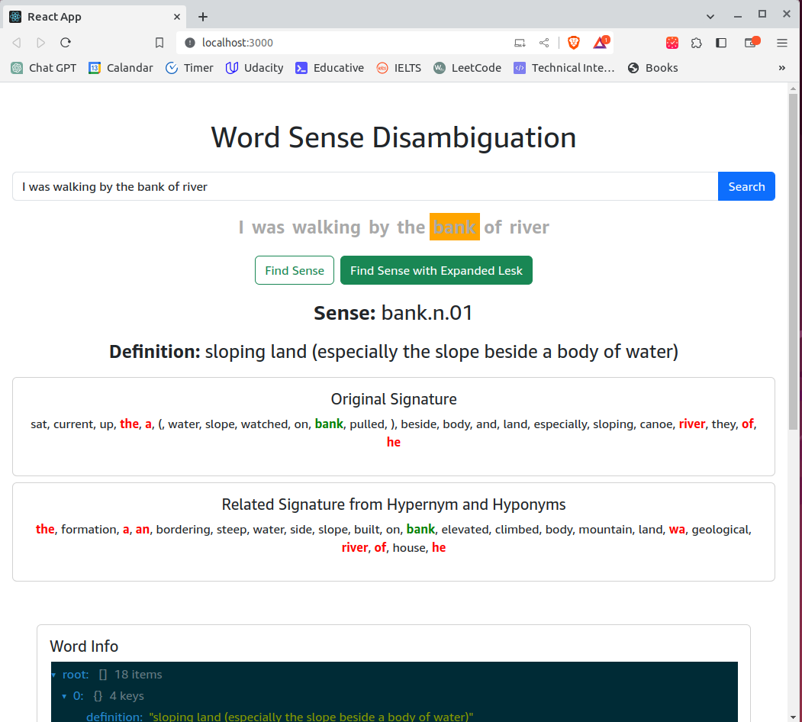

# Project 25: WordSense Disambiguation 1

[](http://brhnme.pythonanywhere.com/)



[](http://brhnme.pythonanywhere.com/)

---

## Table of Contents

1. [Introduction](#introduction)
2. [Project Objectives](#project-objectives)
3. [Setup and Installation](#setup-and-installation)
    - [Dependencies and Prerequisites](#dependencies-and-prerequisites)
    - [Installing](#installing)
    - [Configuration](#configuration)
4. [Running the Application](#running-the-application)
    - [Running the project](#running-the-project)
    - [Building for production](#building-for-production)
    - [Serving the production build with Flask](#serving-the-production-build-with-flask)
5. [Using the GUI](#using-the-gui)
6. [Building and Running with Docker](#building-and-running-with-docker)
    - [Prerequisites](#prerequisites-docker)
    - [Building the Docker Image](#building-the-docker-image)
7. [Project Setup Scripts](#project-setup-scripts)
    - [Scripts](#scripts)
        - [setup_venv.sh](#setup_venvsh)
        - [setup_web.sh](#setup_websh)
        - [build_web.sh](#build_websh)
    - [Important Notes](#important-notes)
8. [License](#license)
9. [Contributors](#contributors)
10. [Acknowledgments](#acknowledgments)

---

## Introduction

The WordSense Disambiguation (WSD) project is an advanced implementation aimed at determining the intended sense of
words within a given context using Natural Language Processing (NLP) techniques. This project leverages Python's NLTK
library, WordNet, and various supervised classification methods to accurately infer the meanings of words in sentences.

Utilizing the senseval-2 dataset, which is rich in annotations and tagged with parts of speech and specific word senses,
this project endeavors to create a robust WSD system. The dataset includes a diverse selection of texts from sources
like the British National Corpus and the Wall Street Journal, providing a challenging and varied test bed for WSD
algorithms.

### Project Objectives:

1. **Understanding and Testing the Base Program:** Comprehend and ensure the proper functioning of an existing WSD
   program that uses the Naive Bayes classifier for disambiguating word senses in the senseval-2 dataset.

2. **Enhancing Performance Metrics:** Extend the base program to include additional performance metrics such as
   accuracy, F1 score, precision, and recall.

3. **Classifier Comparison:** Implement and compare other classification algorithms like Random Forest, SVM, and
   Decision Trees, analyzing their performance in terms of F1 score, accuracy, precision, and recall.

4. **Preprocessing Influence:** Study the effect of different preprocessing steps on the performance metrics and present
   the findings.

5. **Feature Influence:** Test how different features (such as the number of features, tf-idf, and bi-grams) impact the
   performance of the classifiers.

6. **Lesk Algorithm Implementation and Testing:** Utilize NLTK's Lesk algorithm for WSD and compare its results against
   the Naive Bayes classifier on both training and testing datasets.

7. **Expanded Lesk Algorithm:** Design and implement an enhanced version of the Lesk algorithm that includes related
   terms extracted from WordNet, and compare its effectiveness with the standard Lesk algorithm.

8. **Results Comparison and Analysis:** Compare results on a sample of the Senseval2 dataset to draw conclusions on the
   effectiveness of the various methods employed.

9. **GUI Development:** Develop a simple graphical user interface (GUI) that enables users to input a target word and
   context for disambiguation, displaying results from both the simple and expanded Lesk algorithms.

## Project Folder Structure

Below is the outline of the project's directory and file structure:

```bash
wsd-senseval-lesk # Root folder of the project
│
├── app.py # The flask application entry point [task 8]
│
├── web # React web application (frontend) [task 8]
│
├── notebooks # Jupyter notebooks for all analysis and explorations
│ └── .ipynb files # Individual Jupyter notebooks for analysis [tasks 1-8]
│
├── scripts # Python scripts 
│ └── .py files # Standalone Python scripts for various tasks (mostly various implementation of lesk) [task 6-7]
│
├── data # Data directory for CSV exports from our analysis and datasets
│ └── .csv files # CSV dataset files
│
├── *.sh # Customized shell scripts for easily setting up and running this project
│
├── Dockerfile # For running this project as docker container [under development]
│
└── screenshots # Screenshots of the app for documentation
```

## Getting Started

These instructions will get you a copy of the project up and running on your local machine for development and testing
purposes.

### Dependencies and Prerequisites

To run this project, you'll need to install the following software:

- **Jupyter Notebook**: For interactive computing and sharing of live code, equations, visualizations, and narrative
  text. [Installation Guide](https://jupyter.org/install)

- **Node.js and npm**: Node.js is a JavaScript runtime built on Chrome's V8 JavaScript engine, and npm is the package
  manager for
  JavaScript. [Installation Guide for Node.js](https://nodejs.org/en/download/), [npm is included with Node.js](https://www.npmjs.com/get-npm)

- **Python 3**: An interpreted, high-level, general-purpose programming language. Make sure you have Python 3.10 or
  later for this project. [Installation Guide](https://www.python.org/downloads/)

- **Flask**: A lightweight WSGI web application framework in Python. It is designed to make getting started quick and
  easy, with the ability to scale up to complex
  applications. [Installation Guide](https://flask.palletsprojects.com/en/latest/installation/)

- **NLTK**: A leading platform for building Python programs to work with human language
  data. [Installation Guide](https://www.nltk.org/install.html)

- **Docker**: Docker is a set of platform as a service products that use OS-level virtualization to deliver software in
  packages called containers. [Installation Guide](https://docs.docker.com/get-docker/)

Please follow the installation guides provided by the links to ensure that your environment is set up correctly. After
installation, you can verify the installation of each by checking their versions using the respective command line
tools.

For example, to check if you have the correct version of Python installed, run:

```sh
python3 --version
```

```bash
node --version
npm --version
```

Once all dependencies are installed, you can proceed with setting up the virtual environment and running the project as
described below.

### Installing

Follow these steps to get your development environment running:

1. **Clone the repository:**

```bash
git clone https://github.com/brhn-me/wsd-senseval-lesk.git
cd wsd-senseval-lesk
```

2. **Python Virtual Environment Setup:**

Ensure Python 3.10+ is installed on your system before setting up a virtual environment. Follow these simple steps to
get started:

```bash
python3 -m venv venv
source venv/bin/activate  # On Windows use `venv\Scripts\activate`

# Deactivate the environment when done using:
# deactivate
```

3. **Install required packages::**

```bash
pip install -r requirements.txt
```

4. **Downloading NLTK Datasets**

After setting up your Python virtual environment, you'll need to download specific NLTK datasets
required for the application. To download the `stopwords`, `punkt`, and `wordnet` datasets, you can use the following
commands within your activated virtual environment:

```bash
python -m nltk.downloader stopwords
python -m nltk.downloader punkt
python -m nltk.downloader wordnet
```

5. **Install web (react) project dependencies:**

```bash
cd web
npm install
cd ..
```

You can also check the `README` file in `/web` folder for more details instructions on how to configure the React app
for development.

## Configuration

To configure the Flask backend API:

(Optional) If your React app makes requests to a Flask API, update the API base URL in your React app's .env file or
wherever you store your configuration:

```
REACT_APP_API_BASE_URL=http://localhost:5000/api
```

Set environment variables needed for Flask.

## Running the project

To run the project locally:

1. Start the React development server:

```bash
cd web
npm start
```

This command will start the React application and open it in your default web browser.

2. To run the Flask server, navigate to the server directory and run:

```bash
flask run
# or
python3 app.py
```

Your Flask API should now be serving requests at `http://localhost:5000/api`.

## Building for production

To create a production build of the React app, run:

```bash
cd web
npm run build
cd ..
```

This command will create a build directory with all the production files.

## Serving the production build with Flask

To serve the production build files with Flask, ensure the Flask server is configured to serve the static files from the
build directory:

```bash
from flask import Flask, send_from_directory

app = Flask(__name__, static_folder='../deploy/web')

# ... existing Flask routes

if __name__ == '__main__':
    app.run(use_reloader=True, port=5000, threaded=True)
```

After configuration, run your Flask app, and it will serve your React app at the root endpoint.

## Running with Docker

This section covers the setup and deployment of the Word Sense Disambiguation GUI using Docker.

### Prerequisites

- Docker installed on your machine. Installation guides for Docker can be
  found [here](https://docs.docker.com/get-docker/).

### Building the Docker Image

To build the Docker image for the application, navigate to the root directory of the project where the `Dockerfile` is
located and run the following command:

```bash
docker build -t wsd-app-image .
```

# Project Setup Scripts

To streamline the setup and execution of the web application and its backend, we have included several shell scripts
within the repository.
These scripts simplify the processes of environment setup, dependency installation, and project building. Below is an
overview of each script and instructions on how to use them:

## Scripts

### setup_venv.sh

This script is responsible for creating a Python virtual environment using Python 3.10, upgrading pip to the latest
version, and installing all the required dependencies listed in `requirements.txt`. It also downloads necessary NLTK
data for the project.

#### Usage

To use the script, simply run:

```bash
./setup_venv.sh
```

Make sure to give executable permissions to the script before running it:

```bash
chmod +x setup_venv.sh
```

### setup_web.sh

The `setup_web.sh` script is for setting up the React application located in the `/web` directory. It installs all
necessary npm dependencies.

#### Usage

Run the following command in the terminal:

```bash
./setup_web.sh
```

Ensure the script is executable:

```bash
chmod +x setup_web.sh
```

### build_web.sh

This script will navigate to the `/web` directory, install npm dependencies if not already installed, and then build the
React application. After building, it will copy the build artifacts to a `deploy/web` directory.

#### Usage

Execute the script with:

```bash
./build_web.sh
```

Again, don't forget to set the script as executable:

```bash
chmod +x build_web.sh
```

## Important Notes

- Before running any of the scripts, ensure that you have Python 3.10 and npm installed on your machine.
- You may need to activate the virtual environment created by `setup_venv.sh` script manually
  using `source venv/bin/activate` (for Unix-like OS) or `.\venv\Scripts\activate` (for Windows) to run Python
  applications within the virtual environment.
- The scripts assume the presence of `requirements.txt` and `package.json` in their respective directories for
  dependency management.
- Ensure you are in the root directory of the project when running these scripts.

If you encounter any permissions issues, you may need to run the scripts with `sudo` on Unix-like systems or as an
administrator on Windows.

[](http://brhnme.pythonanywhere.com/)
